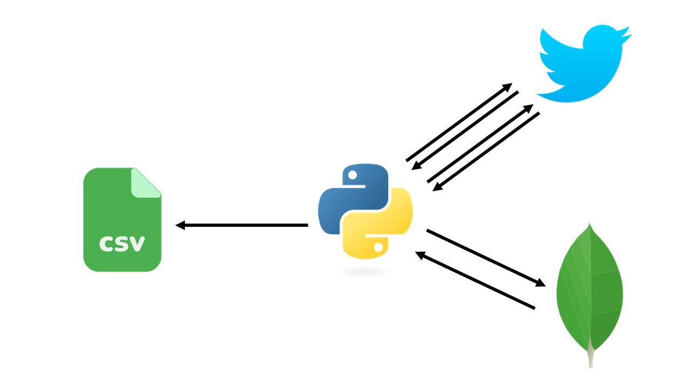

# Extrator de Tweets
## Descrição do projeto
Extrator de dados do twitter para criação de massa de dados, para futuro treinamento de modelo, machine learning, de analise de sentimentos. 

## Funcionalidades do projeto

- `Funcionalidade 1`: Extrai, e exibe, o top10 dos tópicos mais citados no Twitter. 
- `Funcionalidade 2`: Extrai uma massa de tweets com base no top10.
- `Funcionalidade 3`: Efetua uma rotulação dos sentimentos nos tweets extraidos. 

## Aplicação



Após a conexão com a API do Twitter é enviada uma solicitação da lista dos tópicos mais citados (trending topics) da rede social. 


```python
# extração dos trends topics do Brasil
brazil_trends = api.trends_place(BRAZIL_WOE_ID)
```

Depois de ser reduzida de 50 tópicos para 10, criando assim um top10, uma nova solicitação a API é realizada, mas dessa vez pedindo os tweets relacionados a cada tópico da lista, formando assim uma massa de 200 tweets por tópico.

```python
query_search = trends_top10_list[i] + ' -filter:retweets'
cursor_tweets = tw.Cursor(api.search, q=query_search, lang="pt").items(200)
```

Essa massa de dados crua é armazenada no Mongodb e posteriormente devolvida para o jupter notebook para limpeza e modificação, continuando assim o processo de ETL.

```python
# enviar a coleção de dados originais (raw) para o banco de dados
tweets_collection.insert_one(tweet._json)
```

As colunas que não são utilizadas são removidas e a coluna do texto sofre um tratamento de classificação e de rotulação, mas o resultado é salvo em uma nova coluna.

A classificação do sentimento do texto é realizada com auxílio da biblioteca de processamento de linguagem natural Lea (desenvolvida pelo Rafael Almeida) que se trata de um fork da Vader, adaptada para o português. A escolha dessa biblioteca foi feita por ter um tratamento especial com tweets, reconhecendo os sentimentos dos emojis.

A coluna que foi gerada com a limpeza dos dados, utilizando técnicas como remoção de stopword e de caracteres indesejados, foi criada para utilização no futuro treinamento de modelos de machine learnig, já que a classificação feita pela técnica do Lea não necessita desse tratamento.

Depois de tudo realizando o resultado final é armazenado em um arquivo .csv.

```python
tweets_df.to_csv('twitter_sentiments.csv')
```
                                                                                                            
## Ferramentas utilizadas
- `Jupyter Notebook`
- `Python`

## Acesso ao projeto

Você pode acessar o [código fonte do projeto](https://github.com/alan-vieira/extrator_tweets/blob/main/extrator_tweets.ipynb) ou [baixá-lo](https://github.com/alan-vieira/extrator_tweets/archive/refs/heads/main.zip).

## Abrir e rodar o projeto
Após baixado, para o funcionamento correto da aplicação as seguintes dependêcias deverão ser instaladas.

- `Pandas`

## Autor

| [<br><sub>Alan Vieira</sub>](https://github.com/alan-vieira) |
| :---: |
